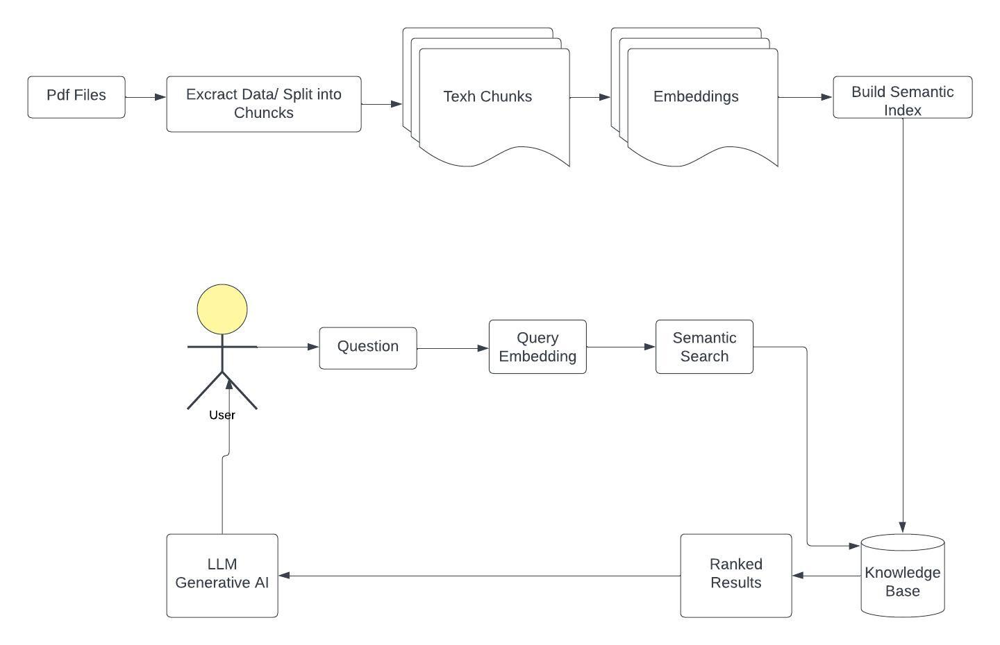

# 🏠 Welcome to Socratic Chatbot and More 👋

# 1. Socratic ChatBot Application

## Overview
Welcome to the Socratic ChatBot application! While ChatGPT excels in interactive conversations, it may generate inaccurate information, commonly known as hallucination. To address this challenge, we have implemented a Retrieval Augmented Generation (RAG) approach using specially curated high-quality data from the Stanford Philosophy Encyclopedia.

## What is Retrieval Augmented Generation (RAG)?
Large-language models (LLMs) like OpenAI's GPT-4 often lack specific subject-matter expertise and struggle with up-to-date information retrieval. RAG addresses these limitations by combining an information retrieval component with text generation. This allows the model to provide more accurate and reliable responses.

## The Problem with LLMs
Despite their capabilities, LLMs face challenges:
- Limited access to up-to-date information.
- Lack of subject-matter expertise, leading to hallucinations.
- Citations are tricky, making fact-checking difficult.

## Retrieval Augmented Generation (RAG)
RAG integrates an information retriever with a text generator:
1. The retriever finds relevant information using "Maximum Inner Product Search (MIPS)."
2. The generator utilizes this information to produce accurate and well-cited responses.
3. Users can verify sources and delve deeper into the provided information.

 # 2. PDF Query LLM Application

## Overview
Welcome to the PDF Query LLM application! This tool harnesses the power of Large-Language Models (LLMs) to assist with queries related to PDF documents. While LLMs excel in generating coherent text, they face challenges with document-specific queries. In this application, we explore how to overcome these limitations using specially designed queries for PDFs.

## The Role of Large-Language Models (LLMs)
LLMs like OpenAI's GPT-4 are remarkable for tasks like writing, translation, and general conversations. However, they encounter difficulties when dealing with document-specific queries, such as those related to PDF files.

## The Problem Statement
LLMs struggle with:
- Understanding and processing queries specific to PDF documents.
- Extracting relevant information from PDF files.
- Generating accurate responses to document-related questions.

## Addressing Challenges with PDF Query LLM
To overcome these challenges, we introduce the PDF Query LLM application:
- Tailored queries designed for PDF document interactions.
- Improved processing of document-specific queries.
- Enhanced accuracy in responses related to PDF content.

## How It Works
1. User inputs a query related to PDF documents.
2. PDF Query LLM processes the query with a focus on document-specific understanding.
3. LLM generates accurate responses tailored to the content of PDF files.
